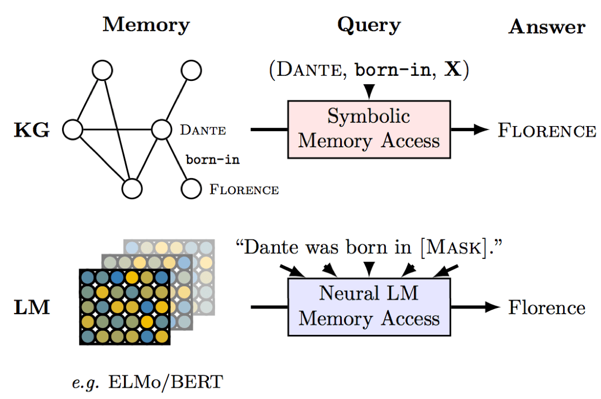

# Learning the Latent structure in LLMs

We will be learning what are large language models and how they can be used as knowledge bases. At the end we will be building and training a BERT and a miniGPT entirely from scratch though our miniGPT won't be as powerful as the GPT models out there, we will learn how we can improve our model and some of the techniques that can be used to align them towards instructions at the very end of the project, if time permits :). The aim of the project is to make you so well versed in LLMs that you can build and train one from scratch on the go.

## Prerequisites

Basics of probability theory, statistical machine learning and python

## Week wise distribution of content

Week 1 : Gentle Introduction to NLP with word2vec, word embeddings, Distributional sementics
Week 2 : Introduction to pytorch and neural networks, convolutional layers and pooling, building cnns and training them on dummy datasets
Week 3 : Text classification, building generative and discriminative models
Week 4 : Language Modeling, N gram LMs, Neural LMs, evaluating LMs
Week 5 : Building encoder-decoder models, autoencoder and inferencing
Week 6 : Introducing attention(Transformer: Attention is All You Need) in encoder-decoders, building a transformer from scratch, Seq2Seq
Week 7 : Transfer learning, replacing pre trained word embeddings in GPT and BERT
Week 8 : Building and training BERT and miniGPT in pytorch from scratch

## Checkpoints

Checkpoint 1 : building and training cnns in pytorch
Checkpoint 2 : building and training a bayesian classifier
Checkpoint 3 : building and training autoencoders for image generation
Checkpoint 4 : building and training a transformer from scratch
Checkpoint 5 : building and training BERT and miniGPT in pytorch from scratch

## Assignment

Python is a very hard pre requisite for this project as we will be putting our intuitive thoughts about natural language understanding into logical structures of rules that the computer will perform via python language, the assignment is based on your proficiency in python

### Problem Statement:

You are a given an integer array A of length m, print the sum of all the elements of A.

**You are not allowed to use while or for loops and iterators E.x statements such as [ i for i in range(5)] or sum(A) are not allowed**

**Your program should take the input from a text file and print the output in a separated text file, examples of both of which are given below**

### Input

The first line of the input contains the number of test cases, for each test case the first lines contains the length of the array A and the second line contains the space separated elements of A

Example input has been provided [here](assignment\input.txt)

### Output

For each array print the sum of the values of it's elements

Example output has been provided [here](assignment\output.txt)

### Submission

Provide a link to your submission python script or jupyter notebook in your SOP or Proposal

## Resources

To get started with python : https://docs.python.org/3.11/tutorial/index.html
